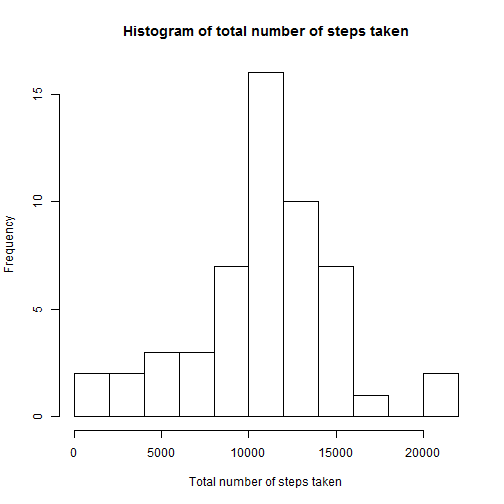
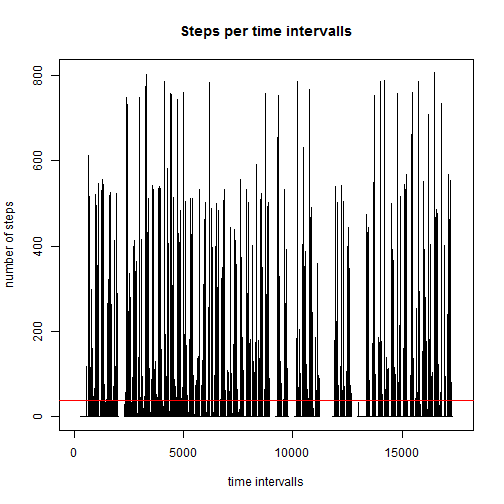
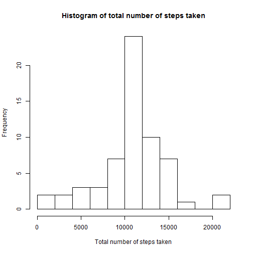
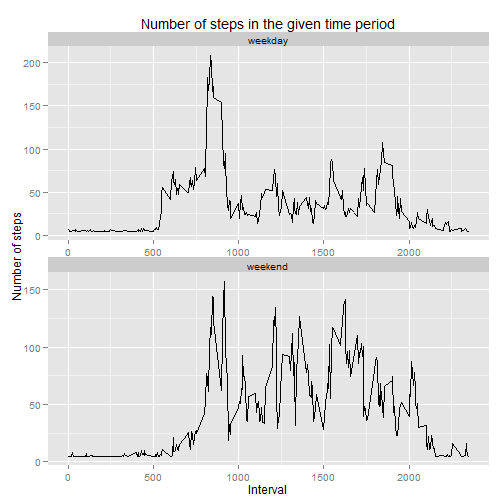

## Loading and preprocessing the data

1. Load the data (i.e. read.csv())
2. Process/transform the data (if necessary) into a format suitable for your analysis


```r
setwd('c:/GIT/RepData_PeerAssessment1/')
activities <- read.csv('activity.csv')
activities$date  <- as.Date(activities$date)
head(activities)
```

```
##   steps       date interval
## 1    NA 2012-10-01        0
## 2    NA 2012-10-01        5
## 3    NA 2012-10-01       10
## 4    NA 2012-10-01       15
## 5    NA 2012-10-01       20
## 6    NA 2012-10-01       25
```

## What is mean total number of steps taken per day?

1. Make a histogram of the total number of steps taken each day


```r
library(plyr)
sum_steps <- ddply(activities, c("date"), summarise, number.of.steps=sum(steps), daily.mean=mean(steps), daily.median=median(steps, na.rm = FALSE))
hist(sum_steps$number.of.steps,main = "Histogram of total number of steps taken",xlab='Total number of steps taken',breaks=15)
```

 

2. Reporting the mean and median total number of steps taken per day


```r
#install.packages('xtable')
library(xtable)
xt <- xtable(sum_steps)
print(xt, type="html")
```

```
## Warning in formatC(x = structure(c(15614, 15615, 15616, 15617, 15618,
## 15619, : class of 'x' was discarded
```

<!-- html table generated in R 3.0.3 by xtable 1.7-4 package -->
<!-- Sat Dec 13 23:40:03 2014 -->
<table border=1>
<tr> <th>  </th> <th> date </th> <th> number.of.steps </th> <th> daily.mean </th> <th> daily.median </th>  </tr>
  <tr> <td align="right"> 1 </td> <td align="right"> 15614.00 </td> <td align="right">  </td> <td align="right">  </td> <td align="right">  </td> </tr>
  <tr> <td align="right"> 2 </td> <td align="right"> 15615.00 </td> <td align="right"> 126 </td> <td align="right"> 0.44 </td> <td align="right"> 0.00 </td> </tr>
  <tr> <td align="right"> 3 </td> <td align="right"> 15616.00 </td> <td align="right"> 11352 </td> <td align="right"> 39.42 </td> <td align="right"> 0.00 </td> </tr>
  <tr> <td align="right"> 4 </td> <td align="right"> 15617.00 </td> <td align="right"> 12116 </td> <td align="right"> 42.07 </td> <td align="right"> 0.00 </td> </tr>
  <tr> <td align="right"> 5 </td> <td align="right"> 15618.00 </td> <td align="right"> 13294 </td> <td align="right"> 46.16 </td> <td align="right"> 0.00 </td> </tr>
  <tr> <td align="right"> 6 </td> <td align="right"> 15619.00 </td> <td align="right"> 15420 </td> <td align="right"> 53.54 </td> <td align="right"> 0.00 </td> </tr>
  <tr> <td align="right"> 7 </td> <td align="right"> 15620.00 </td> <td align="right"> 11015 </td> <td align="right"> 38.25 </td> <td align="right"> 0.00 </td> </tr>
  <tr> <td align="right"> 8 </td> <td align="right"> 15621.00 </td> <td align="right">  </td> <td align="right">  </td> <td align="right">  </td> </tr>
  <tr> <td align="right"> 9 </td> <td align="right"> 15622.00 </td> <td align="right"> 12811 </td> <td align="right"> 44.48 </td> <td align="right"> 0.00 </td> </tr>
  <tr> <td align="right"> 10 </td> <td align="right"> 15623.00 </td> <td align="right"> 9900 </td> <td align="right"> 34.38 </td> <td align="right"> 0.00 </td> </tr>
  <tr> <td align="right"> 11 </td> <td align="right"> 15624.00 </td> <td align="right"> 10304 </td> <td align="right"> 35.78 </td> <td align="right"> 0.00 </td> </tr>
  <tr> <td align="right"> 12 </td> <td align="right"> 15625.00 </td> <td align="right"> 17382 </td> <td align="right"> 60.35 </td> <td align="right"> 0.00 </td> </tr>
  <tr> <td align="right"> 13 </td> <td align="right"> 15626.00 </td> <td align="right"> 12426 </td> <td align="right"> 43.15 </td> <td align="right"> 0.00 </td> </tr>
  <tr> <td align="right"> 14 </td> <td align="right"> 15627.00 </td> <td align="right"> 15098 </td> <td align="right"> 52.42 </td> <td align="right"> 0.00 </td> </tr>
  <tr> <td align="right"> 15 </td> <td align="right"> 15628.00 </td> <td align="right"> 10139 </td> <td align="right"> 35.20 </td> <td align="right"> 0.00 </td> </tr>
  <tr> <td align="right"> 16 </td> <td align="right"> 15629.00 </td> <td align="right"> 15084 </td> <td align="right"> 52.38 </td> <td align="right"> 0.00 </td> </tr>
  <tr> <td align="right"> 17 </td> <td align="right"> 15630.00 </td> <td align="right"> 13452 </td> <td align="right"> 46.71 </td> <td align="right"> 0.00 </td> </tr>
  <tr> <td align="right"> 18 </td> <td align="right"> 15631.00 </td> <td align="right"> 10056 </td> <td align="right"> 34.92 </td> <td align="right"> 0.00 </td> </tr>
  <tr> <td align="right"> 19 </td> <td align="right"> 15632.00 </td> <td align="right"> 11829 </td> <td align="right"> 41.07 </td> <td align="right"> 0.00 </td> </tr>
  <tr> <td align="right"> 20 </td> <td align="right"> 15633.00 </td> <td align="right"> 10395 </td> <td align="right"> 36.09 </td> <td align="right"> 0.00 </td> </tr>
  <tr> <td align="right"> 21 </td> <td align="right"> 15634.00 </td> <td align="right"> 8821 </td> <td align="right"> 30.63 </td> <td align="right"> 0.00 </td> </tr>
  <tr> <td align="right"> 22 </td> <td align="right"> 15635.00 </td> <td align="right"> 13460 </td> <td align="right"> 46.74 </td> <td align="right"> 0.00 </td> </tr>
  <tr> <td align="right"> 23 </td> <td align="right"> 15636.00 </td> <td align="right"> 8918 </td> <td align="right"> 30.97 </td> <td align="right"> 0.00 </td> </tr>
  <tr> <td align="right"> 24 </td> <td align="right"> 15637.00 </td> <td align="right"> 8355 </td> <td align="right"> 29.01 </td> <td align="right"> 0.00 </td> </tr>
  <tr> <td align="right"> 25 </td> <td align="right"> 15638.00 </td> <td align="right"> 2492 </td> <td align="right"> 8.65 </td> <td align="right"> 0.00 </td> </tr>
  <tr> <td align="right"> 26 </td> <td align="right"> 15639.00 </td> <td align="right"> 6778 </td> <td align="right"> 23.53 </td> <td align="right"> 0.00 </td> </tr>
  <tr> <td align="right"> 27 </td> <td align="right"> 15640.00 </td> <td align="right"> 10119 </td> <td align="right"> 35.14 </td> <td align="right"> 0.00 </td> </tr>
  <tr> <td align="right"> 28 </td> <td align="right"> 15641.00 </td> <td align="right"> 11458 </td> <td align="right"> 39.78 </td> <td align="right"> 0.00 </td> </tr>
  <tr> <td align="right"> 29 </td> <td align="right"> 15642.00 </td> <td align="right"> 5018 </td> <td align="right"> 17.42 </td> <td align="right"> 0.00 </td> </tr>
  <tr> <td align="right"> 30 </td> <td align="right"> 15643.00 </td> <td align="right"> 9819 </td> <td align="right"> 34.09 </td> <td align="right"> 0.00 </td> </tr>
  <tr> <td align="right"> 31 </td> <td align="right"> 15644.00 </td> <td align="right"> 15414 </td> <td align="right"> 53.52 </td> <td align="right"> 0.00 </td> </tr>
  <tr> <td align="right"> 32 </td> <td align="right"> 15645.00 </td> <td align="right">  </td> <td align="right">  </td> <td align="right">  </td> </tr>
  <tr> <td align="right"> 33 </td> <td align="right"> 15646.00 </td> <td align="right"> 10600 </td> <td align="right"> 36.81 </td> <td align="right"> 0.00 </td> </tr>
  <tr> <td align="right"> 34 </td> <td align="right"> 15647.00 </td> <td align="right"> 10571 </td> <td align="right"> 36.70 </td> <td align="right"> 0.00 </td> </tr>
  <tr> <td align="right"> 35 </td> <td align="right"> 15648.00 </td> <td align="right">  </td> <td align="right">  </td> <td align="right">  </td> </tr>
  <tr> <td align="right"> 36 </td> <td align="right"> 15649.00 </td> <td align="right"> 10439 </td> <td align="right"> 36.25 </td> <td align="right"> 0.00 </td> </tr>
  <tr> <td align="right"> 37 </td> <td align="right"> 15650.00 </td> <td align="right"> 8334 </td> <td align="right"> 28.94 </td> <td align="right"> 0.00 </td> </tr>
  <tr> <td align="right"> 38 </td> <td align="right"> 15651.00 </td> <td align="right"> 12883 </td> <td align="right"> 44.73 </td> <td align="right"> 0.00 </td> </tr>
  <tr> <td align="right"> 39 </td> <td align="right"> 15652.00 </td> <td align="right"> 3219 </td> <td align="right"> 11.18 </td> <td align="right"> 0.00 </td> </tr>
  <tr> <td align="right"> 40 </td> <td align="right"> 15653.00 </td> <td align="right">  </td> <td align="right">  </td> <td align="right">  </td> </tr>
  <tr> <td align="right"> 41 </td> <td align="right"> 15654.00 </td> <td align="right">  </td> <td align="right">  </td> <td align="right">  </td> </tr>
  <tr> <td align="right"> 42 </td> <td align="right"> 15655.00 </td> <td align="right"> 12608 </td> <td align="right"> 43.78 </td> <td align="right"> 0.00 </td> </tr>
  <tr> <td align="right"> 43 </td> <td align="right"> 15656.00 </td> <td align="right"> 10765 </td> <td align="right"> 37.38 </td> <td align="right"> 0.00 </td> </tr>
  <tr> <td align="right"> 44 </td> <td align="right"> 15657.00 </td> <td align="right"> 7336 </td> <td align="right"> 25.47 </td> <td align="right"> 0.00 </td> </tr>
  <tr> <td align="right"> 45 </td> <td align="right"> 15658.00 </td> <td align="right">  </td> <td align="right">  </td> <td align="right">  </td> </tr>
  <tr> <td align="right"> 46 </td> <td align="right"> 15659.00 </td> <td align="right">  41 </td> <td align="right"> 0.14 </td> <td align="right"> 0.00 </td> </tr>
  <tr> <td align="right"> 47 </td> <td align="right"> 15660.00 </td> <td align="right"> 5441 </td> <td align="right"> 18.89 </td> <td align="right"> 0.00 </td> </tr>
  <tr> <td align="right"> 48 </td> <td align="right"> 15661.00 </td> <td align="right"> 14339 </td> <td align="right"> 49.79 </td> <td align="right"> 0.00 </td> </tr>
  <tr> <td align="right"> 49 </td> <td align="right"> 15662.00 </td> <td align="right"> 15110 </td> <td align="right"> 52.47 </td> <td align="right"> 0.00 </td> </tr>
  <tr> <td align="right"> 50 </td> <td align="right"> 15663.00 </td> <td align="right"> 8841 </td> <td align="right"> 30.70 </td> <td align="right"> 0.00 </td> </tr>
  <tr> <td align="right"> 51 </td> <td align="right"> 15664.00 </td> <td align="right"> 4472 </td> <td align="right"> 15.53 </td> <td align="right"> 0.00 </td> </tr>
  <tr> <td align="right"> 52 </td> <td align="right"> 15665.00 </td> <td align="right"> 12787 </td> <td align="right"> 44.40 </td> <td align="right"> 0.00 </td> </tr>
  <tr> <td align="right"> 53 </td> <td align="right"> 15666.00 </td> <td align="right"> 20427 </td> <td align="right"> 70.93 </td> <td align="right"> 0.00 </td> </tr>
  <tr> <td align="right"> 54 </td> <td align="right"> 15667.00 </td> <td align="right"> 21194 </td> <td align="right"> 73.59 </td> <td align="right"> 0.00 </td> </tr>
  <tr> <td align="right"> 55 </td> <td align="right"> 15668.00 </td> <td align="right"> 14478 </td> <td align="right"> 50.27 </td> <td align="right"> 0.00 </td> </tr>
  <tr> <td align="right"> 56 </td> <td align="right"> 15669.00 </td> <td align="right"> 11834 </td> <td align="right"> 41.09 </td> <td align="right"> 0.00 </td> </tr>
  <tr> <td align="right"> 57 </td> <td align="right"> 15670.00 </td> <td align="right"> 11162 </td> <td align="right"> 38.76 </td> <td align="right"> 0.00 </td> </tr>
  <tr> <td align="right"> 58 </td> <td align="right"> 15671.00 </td> <td align="right"> 13646 </td> <td align="right"> 47.38 </td> <td align="right"> 0.00 </td> </tr>
  <tr> <td align="right"> 59 </td> <td align="right"> 15672.00 </td> <td align="right"> 10183 </td> <td align="right"> 35.36 </td> <td align="right"> 0.00 </td> </tr>
  <tr> <td align="right"> 60 </td> <td align="right"> 15673.00 </td> <td align="right"> 7047 </td> <td align="right"> 24.47 </td> <td align="right"> 0.00 </td> </tr>
  <tr> <td align="right"> 61 </td> <td align="right"> 15674.00 </td> <td align="right">  </td> <td align="right">  </td> <td align="right">  </td> </tr>
   </table>

## What is the average daily activity pattern?

1. Make a time series plot (i.e. type = "l") of the 5-minute interval (x-axis) and the average number of steps taken, averaged across all days (y-axis)


```r
activities_avg=mean(activities$steps, na.rm=TRUE)
plot(x=activities$steps,type="l",xlab="time intervalls", ylab="number of steps", main="Steps per time intervalls" )
abline(h=activities_avg,col="red")
```

 

2. Which 5-minute interval, on average across all the days in the dataset, contains the maximum number of steps?


```r
#The daily maximum steps
daily_max_steps <- ddply(activities, c("date"), summarise, daily.max=max(steps),.drop=FALSE)
#Maerging back to activity to get the max activity intervalls 
daily_max_intervals <- merge(x=daily_max_steps[!is.na(daily_max_steps$daily.max),], y=activities[!is.na(activities$steps),],by.x=c("date","daily.max"),by.y=c("date","steps"),all=FALSE)
hist(daily_max_intervals$interval,main = "Histogram of the most active intervals",xlab='Interval no.',breaks=15)
```

 

The most active intervalls are around 800-900.   

## Imputing missing values

1. Calculate and report the total number of missing values in the dataset (i.e. the total number of rows with NAs) The total number of activities are  The total number of NA steps are 0.

2. The strategy, for filling in all of the missing values in the dataset, is to get the all times mean for all the data and impute it into the the missing data.

3. The new dataset that is equal to the original dataset but with the missing data filled in


```r
activities_nona = activities
activities_nona[is.na(activities_nona$steps),"steps"]=mean(activities$steps,na.rm=TRUE)
```

4. What is mean total number of steps taken per day on the imputed data.?


```r
library(plyr)
sum_steps <- ddply(activities_nona, c("date"), summarise, number.of.steps=sum(steps), daily.mean=mean(steps), daily.median=median(steps, na.rm = FALSE))
hist(sum_steps$number.of.steps,main = "Histogram of total number of steps taken",xlab='Total number of steps taken',breaks=15)
```

 

Reporting the mean and median total number of steps taken per day on the imputed data


```r
xt <- xtable(sum_steps)
print(xt, type="html")
```

```
## Warning in formatC(x = structure(c(15614, 15615, 15616, 15617, 15618,
## 15619, : class of 'x' was discarded
```

<!-- html table generated in R 3.0.3 by xtable 1.7-4 package -->
<!-- Sat Dec 13 23:40:04 2014 -->
<table border=1>
<tr> <th>  </th> <th> date </th> <th> number.of.steps </th> <th> daily.mean </th> <th> daily.median </th>  </tr>
  <tr> <td align="right"> 1 </td> <td align="right"> 15614.00 </td> <td align="right"> 10766.19 </td> <td align="right"> 37.38 </td> <td align="right"> 37.38 </td> </tr>
  <tr> <td align="right"> 2 </td> <td align="right"> 15615.00 </td> <td align="right"> 126.00 </td> <td align="right"> 0.44 </td> <td align="right"> 0.00 </td> </tr>
  <tr> <td align="right"> 3 </td> <td align="right"> 15616.00 </td> <td align="right"> 11352.00 </td> <td align="right"> 39.42 </td> <td align="right"> 0.00 </td> </tr>
  <tr> <td align="right"> 4 </td> <td align="right"> 15617.00 </td> <td align="right"> 12116.00 </td> <td align="right"> 42.07 </td> <td align="right"> 0.00 </td> </tr>
  <tr> <td align="right"> 5 </td> <td align="right"> 15618.00 </td> <td align="right"> 13294.00 </td> <td align="right"> 46.16 </td> <td align="right"> 0.00 </td> </tr>
  <tr> <td align="right"> 6 </td> <td align="right"> 15619.00 </td> <td align="right"> 15420.00 </td> <td align="right"> 53.54 </td> <td align="right"> 0.00 </td> </tr>
  <tr> <td align="right"> 7 </td> <td align="right"> 15620.00 </td> <td align="right"> 11015.00 </td> <td align="right"> 38.25 </td> <td align="right"> 0.00 </td> </tr>
  <tr> <td align="right"> 8 </td> <td align="right"> 15621.00 </td> <td align="right"> 10766.19 </td> <td align="right"> 37.38 </td> <td align="right"> 37.38 </td> </tr>
  <tr> <td align="right"> 9 </td> <td align="right"> 15622.00 </td> <td align="right"> 12811.00 </td> <td align="right"> 44.48 </td> <td align="right"> 0.00 </td> </tr>
  <tr> <td align="right"> 10 </td> <td align="right"> 15623.00 </td> <td align="right"> 9900.00 </td> <td align="right"> 34.38 </td> <td align="right"> 0.00 </td> </tr>
  <tr> <td align="right"> 11 </td> <td align="right"> 15624.00 </td> <td align="right"> 10304.00 </td> <td align="right"> 35.78 </td> <td align="right"> 0.00 </td> </tr>
  <tr> <td align="right"> 12 </td> <td align="right"> 15625.00 </td> <td align="right"> 17382.00 </td> <td align="right"> 60.35 </td> <td align="right"> 0.00 </td> </tr>
  <tr> <td align="right"> 13 </td> <td align="right"> 15626.00 </td> <td align="right"> 12426.00 </td> <td align="right"> 43.15 </td> <td align="right"> 0.00 </td> </tr>
  <tr> <td align="right"> 14 </td> <td align="right"> 15627.00 </td> <td align="right"> 15098.00 </td> <td align="right"> 52.42 </td> <td align="right"> 0.00 </td> </tr>
  <tr> <td align="right"> 15 </td> <td align="right"> 15628.00 </td> <td align="right"> 10139.00 </td> <td align="right"> 35.20 </td> <td align="right"> 0.00 </td> </tr>
  <tr> <td align="right"> 16 </td> <td align="right"> 15629.00 </td> <td align="right"> 15084.00 </td> <td align="right"> 52.38 </td> <td align="right"> 0.00 </td> </tr>
  <tr> <td align="right"> 17 </td> <td align="right"> 15630.00 </td> <td align="right"> 13452.00 </td> <td align="right"> 46.71 </td> <td align="right"> 0.00 </td> </tr>
  <tr> <td align="right"> 18 </td> <td align="right"> 15631.00 </td> <td align="right"> 10056.00 </td> <td align="right"> 34.92 </td> <td align="right"> 0.00 </td> </tr>
  <tr> <td align="right"> 19 </td> <td align="right"> 15632.00 </td> <td align="right"> 11829.00 </td> <td align="right"> 41.07 </td> <td align="right"> 0.00 </td> </tr>
  <tr> <td align="right"> 20 </td> <td align="right"> 15633.00 </td> <td align="right"> 10395.00 </td> <td align="right"> 36.09 </td> <td align="right"> 0.00 </td> </tr>
  <tr> <td align="right"> 21 </td> <td align="right"> 15634.00 </td> <td align="right"> 8821.00 </td> <td align="right"> 30.63 </td> <td align="right"> 0.00 </td> </tr>
  <tr> <td align="right"> 22 </td> <td align="right"> 15635.00 </td> <td align="right"> 13460.00 </td> <td align="right"> 46.74 </td> <td align="right"> 0.00 </td> </tr>
  <tr> <td align="right"> 23 </td> <td align="right"> 15636.00 </td> <td align="right"> 8918.00 </td> <td align="right"> 30.97 </td> <td align="right"> 0.00 </td> </tr>
  <tr> <td align="right"> 24 </td> <td align="right"> 15637.00 </td> <td align="right"> 8355.00 </td> <td align="right"> 29.01 </td> <td align="right"> 0.00 </td> </tr>
  <tr> <td align="right"> 25 </td> <td align="right"> 15638.00 </td> <td align="right"> 2492.00 </td> <td align="right"> 8.65 </td> <td align="right"> 0.00 </td> </tr>
  <tr> <td align="right"> 26 </td> <td align="right"> 15639.00 </td> <td align="right"> 6778.00 </td> <td align="right"> 23.53 </td> <td align="right"> 0.00 </td> </tr>
  <tr> <td align="right"> 27 </td> <td align="right"> 15640.00 </td> <td align="right"> 10119.00 </td> <td align="right"> 35.14 </td> <td align="right"> 0.00 </td> </tr>
  <tr> <td align="right"> 28 </td> <td align="right"> 15641.00 </td> <td align="right"> 11458.00 </td> <td align="right"> 39.78 </td> <td align="right"> 0.00 </td> </tr>
  <tr> <td align="right"> 29 </td> <td align="right"> 15642.00 </td> <td align="right"> 5018.00 </td> <td align="right"> 17.42 </td> <td align="right"> 0.00 </td> </tr>
  <tr> <td align="right"> 30 </td> <td align="right"> 15643.00 </td> <td align="right"> 9819.00 </td> <td align="right"> 34.09 </td> <td align="right"> 0.00 </td> </tr>
  <tr> <td align="right"> 31 </td> <td align="right"> 15644.00 </td> <td align="right"> 15414.00 </td> <td align="right"> 53.52 </td> <td align="right"> 0.00 </td> </tr>
  <tr> <td align="right"> 32 </td> <td align="right"> 15645.00 </td> <td align="right"> 10766.19 </td> <td align="right"> 37.38 </td> <td align="right"> 37.38 </td> </tr>
  <tr> <td align="right"> 33 </td> <td align="right"> 15646.00 </td> <td align="right"> 10600.00 </td> <td align="right"> 36.81 </td> <td align="right"> 0.00 </td> </tr>
  <tr> <td align="right"> 34 </td> <td align="right"> 15647.00 </td> <td align="right"> 10571.00 </td> <td align="right"> 36.70 </td> <td align="right"> 0.00 </td> </tr>
  <tr> <td align="right"> 35 </td> <td align="right"> 15648.00 </td> <td align="right"> 10766.19 </td> <td align="right"> 37.38 </td> <td align="right"> 37.38 </td> </tr>
  <tr> <td align="right"> 36 </td> <td align="right"> 15649.00 </td> <td align="right"> 10439.00 </td> <td align="right"> 36.25 </td> <td align="right"> 0.00 </td> </tr>
  <tr> <td align="right"> 37 </td> <td align="right"> 15650.00 </td> <td align="right"> 8334.00 </td> <td align="right"> 28.94 </td> <td align="right"> 0.00 </td> </tr>
  <tr> <td align="right"> 38 </td> <td align="right"> 15651.00 </td> <td align="right"> 12883.00 </td> <td align="right"> 44.73 </td> <td align="right"> 0.00 </td> </tr>
  <tr> <td align="right"> 39 </td> <td align="right"> 15652.00 </td> <td align="right"> 3219.00 </td> <td align="right"> 11.18 </td> <td align="right"> 0.00 </td> </tr>
  <tr> <td align="right"> 40 </td> <td align="right"> 15653.00 </td> <td align="right"> 10766.19 </td> <td align="right"> 37.38 </td> <td align="right"> 37.38 </td> </tr>
  <tr> <td align="right"> 41 </td> <td align="right"> 15654.00 </td> <td align="right"> 10766.19 </td> <td align="right"> 37.38 </td> <td align="right"> 37.38 </td> </tr>
  <tr> <td align="right"> 42 </td> <td align="right"> 15655.00 </td> <td align="right"> 12608.00 </td> <td align="right"> 43.78 </td> <td align="right"> 0.00 </td> </tr>
  <tr> <td align="right"> 43 </td> <td align="right"> 15656.00 </td> <td align="right"> 10765.00 </td> <td align="right"> 37.38 </td> <td align="right"> 0.00 </td> </tr>
  <tr> <td align="right"> 44 </td> <td align="right"> 15657.00 </td> <td align="right"> 7336.00 </td> <td align="right"> 25.47 </td> <td align="right"> 0.00 </td> </tr>
  <tr> <td align="right"> 45 </td> <td align="right"> 15658.00 </td> <td align="right"> 10766.19 </td> <td align="right"> 37.38 </td> <td align="right"> 37.38 </td> </tr>
  <tr> <td align="right"> 46 </td> <td align="right"> 15659.00 </td> <td align="right"> 41.00 </td> <td align="right"> 0.14 </td> <td align="right"> 0.00 </td> </tr>
  <tr> <td align="right"> 47 </td> <td align="right"> 15660.00 </td> <td align="right"> 5441.00 </td> <td align="right"> 18.89 </td> <td align="right"> 0.00 </td> </tr>
  <tr> <td align="right"> 48 </td> <td align="right"> 15661.00 </td> <td align="right"> 14339.00 </td> <td align="right"> 49.79 </td> <td align="right"> 0.00 </td> </tr>
  <tr> <td align="right"> 49 </td> <td align="right"> 15662.00 </td> <td align="right"> 15110.00 </td> <td align="right"> 52.47 </td> <td align="right"> 0.00 </td> </tr>
  <tr> <td align="right"> 50 </td> <td align="right"> 15663.00 </td> <td align="right"> 8841.00 </td> <td align="right"> 30.70 </td> <td align="right"> 0.00 </td> </tr>
  <tr> <td align="right"> 51 </td> <td align="right"> 15664.00 </td> <td align="right"> 4472.00 </td> <td align="right"> 15.53 </td> <td align="right"> 0.00 </td> </tr>
  <tr> <td align="right"> 52 </td> <td align="right"> 15665.00 </td> <td align="right"> 12787.00 </td> <td align="right"> 44.40 </td> <td align="right"> 0.00 </td> </tr>
  <tr> <td align="right"> 53 </td> <td align="right"> 15666.00 </td> <td align="right"> 20427.00 </td> <td align="right"> 70.93 </td> <td align="right"> 0.00 </td> </tr>
  <tr> <td align="right"> 54 </td> <td align="right"> 15667.00 </td> <td align="right"> 21194.00 </td> <td align="right"> 73.59 </td> <td align="right"> 0.00 </td> </tr>
  <tr> <td align="right"> 55 </td> <td align="right"> 15668.00 </td> <td align="right"> 14478.00 </td> <td align="right"> 50.27 </td> <td align="right"> 0.00 </td> </tr>
  <tr> <td align="right"> 56 </td> <td align="right"> 15669.00 </td> <td align="right"> 11834.00 </td> <td align="right"> 41.09 </td> <td align="right"> 0.00 </td> </tr>
  <tr> <td align="right"> 57 </td> <td align="right"> 15670.00 </td> <td align="right"> 11162.00 </td> <td align="right"> 38.76 </td> <td align="right"> 0.00 </td> </tr>
  <tr> <td align="right"> 58 </td> <td align="right"> 15671.00 </td> <td align="right"> 13646.00 </td> <td align="right"> 47.38 </td> <td align="right"> 0.00 </td> </tr>
  <tr> <td align="right"> 59 </td> <td align="right"> 15672.00 </td> <td align="right"> 10183.00 </td> <td align="right"> 35.36 </td> <td align="right"> 0.00 </td> </tr>
  <tr> <td align="right"> 60 </td> <td align="right"> 15673.00 </td> <td align="right"> 7047.00 </td> <td align="right"> 24.47 </td> <td align="right"> 0.00 </td> </tr>
  <tr> <td align="right"> 61 </td> <td align="right"> 15674.00 </td> <td align="right"> 10766.19 </td> <td align="right"> 37.38 </td> <td align="right"> 37.38 </td> </tr>
   </table>


## Are there differences in activity patterns between weekdays and weekends?

1. Create a new factor variable in the dataset with two levels - "weekday" and "weekend" indicating whether a given date is a weekday or weekend day.


```r
week_or_weekend <- function(x) {
  if(as.Date(x)){
        if (weekdays(x) %in% c("Saturday", "Sunday")) {
            "weekend"
        } else {
            "weekday"
        }
    }
}
activities_nona$week.or.weekend <- as.factor(sapply(activities_nona$date, week_or_weekend))
```

2. Make a panel plot containing a time series plot (i.e. type = "l") of the 5-minute interval (x-axis) and the average number of steps taken, averaged across all weekday days or weekend days (y-axis).


```r
activity_avg <- ddply(activities_nona, c("week.or.weekend", "interval"), summarise, steps_avg=mean(steps))


library(ggplot2)
plot <- ggplot(activity_avg) + 
  geom_line(aes(x=interval, y=steps_avg)) +
  facet_wrap(~week.or.weekend, nrow=2, scales="free") +
  labs(y="Number of steps", x="Interval", title="Number of steps in the given time period") 
plot
```

 
